// from kunal khushwaha and Oracle official documentation and my notes.
1. On the minute level, there are a bunch of 0s and 1s. We give it instructions, and programming languages help us write and convert them into something that machines understand.


**First-class functions** are when functions in a language are treated like any other variable. For example, in such a language, a function can be passed as an argument to other functions, returned by another function, and assigned as a value to a variable.

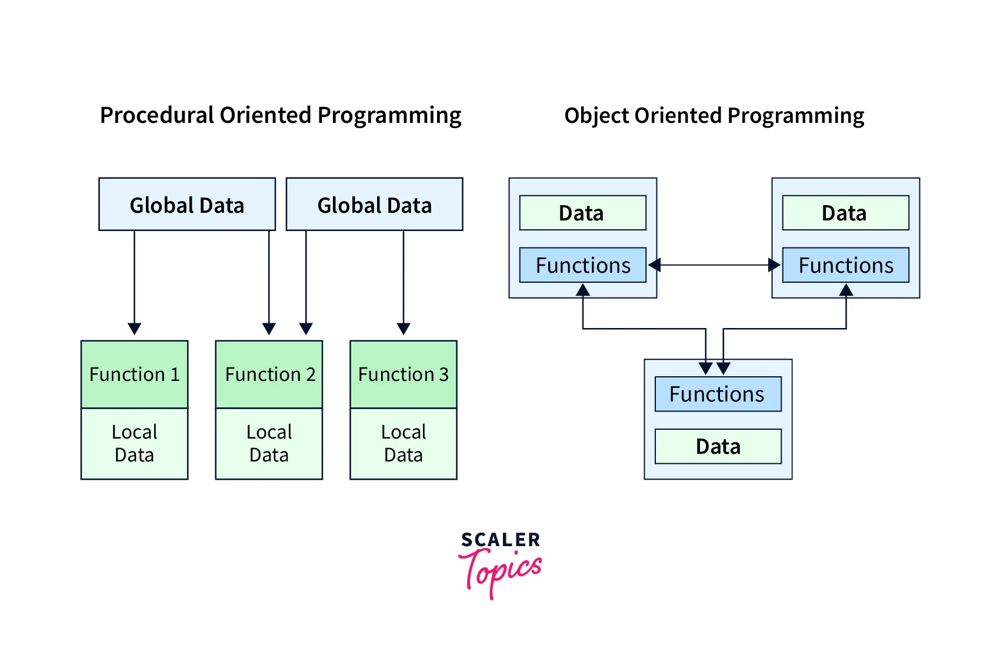


If we need to create a custom datatype that doesn't exist in any previous form,(to catter to our own specific need) we use the `class`. A class is a general template, and an instance (one occurrence) of this class is called an `object`. An object is a specific occurrence. For example, "Naveen" is an instance of the class "human".

Python follows all three paradigms (functional, object-oriented, and procedural), while Java follows OOP and procedural.

*Pure functional languages, such as Haskell, only allow pure functional programs. Other languages allow both functional and procedural programs and are considered impure functional languages.*

Java is statically typed, while Python is dynamically typed.

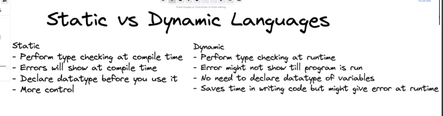

**Compile time** refers to the phase of program execution where the source code is converted into machine code or bytecode. During this phase, the code is checked for syntax errors and type compatibility. If any errors are found, the code cannot be compiled successfully.

**Runtime** refers to the phase of program execution where the compiled code is actually executed. This is when the program interacts with the system and performs its intended tasks. Any errors or exceptions that occur during runtime can be handled or cause the program to terminate.

It is important to understand the difference between compile time and runtime because it affects how errors are detected and handled in a program. Compile time errors are caught before the program is executed, while runtime errors occur during program execution.

```java
int a = 10; // The left side is defined at compile time and cannot change its type. The right side is assigned at runtime, and the variable can be reassigned with another value of the same type.
a = kunal; // This will give an error as the type is different.
```

```python
a = 10 # Both sides are assigned at runtime, so it can change its type on reassignment.
a = kunal # This will not give an error as the type is different.
```

## Memory Management
There are two types of memory: stacks and heaps.

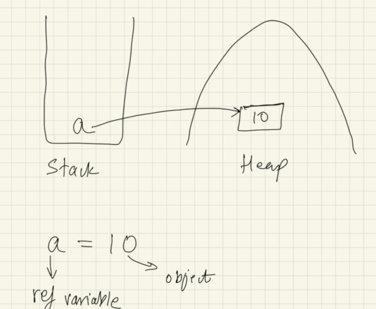

The reference variable is stored in the stack, and the object is stored in the heap. The reference variable points to the object.

Multiple reference variables can point to the same object. If any one of them changes the value of the object, the change will be visible to all the other reference variables pointing to it.

### Objects of classes are created in the heap.
#### Changes in the heap persist, and stack storages are temporary.

### In Java, there is only pass by value. There is no pass by reference because even though a variable might hold a reference to an object, that object reference is a value that represents the object's location in memory. Object references are therefore passed by value.

An object with no reference variable will be removed by the `garbage collector`.

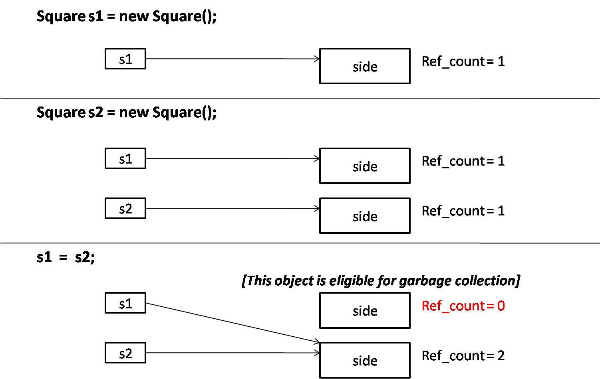

## Basic Hello World Program
```java
public class HelloWorld {
    public static void main(String[] args) {
        System.out.println("Hello, World!");
    }
}
```

Is `String[] args` necessary?
Whenever you run a Java program with the command prompt or want to give command line arguments, then `String[] args` is used. So basically, it takes input from you via command lines. If you don't use command line arguments, then it has no purpose in your code.

## Flow of Program - Flowcharts & Pseudocode

### Flowcharts
Write a program that can read three integers from the user and then determines the smallest value among the three integers.

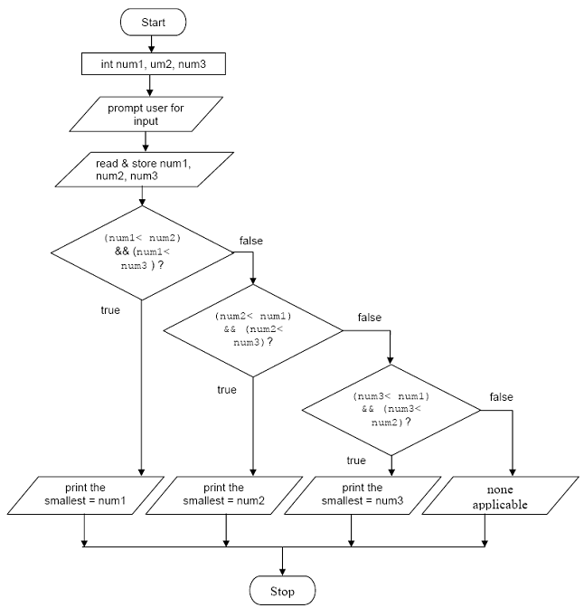

### Pseudocode

Pseudocode is like writing down the steps of a task or a program in a way that anyone can understand, without worrying about the exact rules of a programming language. It's a way to plan out how you want a computer program to work, using plain language and simple descriptions of what needs to be done at each step. It helps you organize your thoughts before you start writing actual code.

Find if a number is prime. 
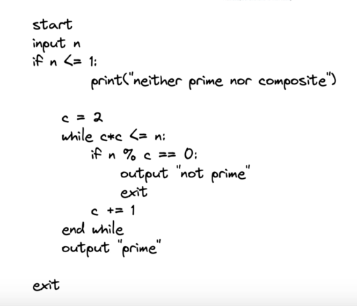

## Java - Architecture 

### Q: Why do we use programming languages?
A: Machines only understand 0s and 1s. For humans, it is very difficult to instruct a computer in 0s and 1s. So, to avoid this issue, we write our code in a human-readable language (programming language). Java is one of the programming languages.

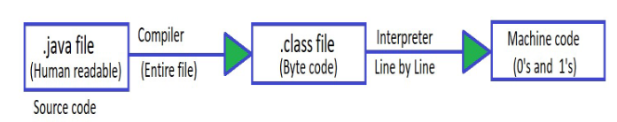
1. The code written in Java is human-readable and is saved using the extension `.java`.
2. This code is known as `source code`.

`Java Compiler:`
1. The Java compiler converts the source code into bytecode, which has the extension `.class`.
2. This bytecode cannot directly run on a system.
3. We need `JVM` to run this.
4. This is the reason why `Java is platform-independent`.

`Java Interpreter:`
1. The Java interpreter converts bytecode to machine code (0s and 1s).
2. It translates the bytecode line by line to machine code.

Java is unique because it doesn't convert the file directly from Java code to machine code. Instead, it adds an intermediate step, which is bytecode. This bytecode needs Java to run and convert it to machine code. This is the reason why Java is independent.

More about Platform Independence:
- It means that bytecode can run on all operating systems.
- We need to convert source code to machine code so the computer can understand it.
- The compiler helps in doing this by turning it into executable code.
- This executable code is a set of instructions for the computer.
- After compiling C/C++ code, we get an .exe file, which is `platform-dependent.`
- In Java, we get bytecode, and JVM converts this to machine code.
- Java is platform-independent, but JVM is platform-dependent.

.
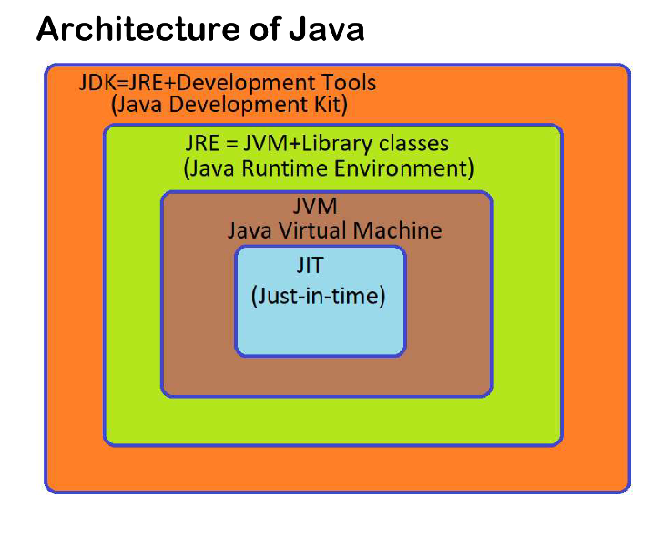

### JDK
- Provides an environment to develop and run Java programs.
- It is a package that includes:
    1. Development tools: To provide an environment to run your program.
    2. JRE: To execute your program.
    3. A compiler: `javac`
    4. Archiver: `jar`
    5. Docs generator: `javadoc`
    6. Interpreter/loader

### JRE
- It is an installation package that provides an environment to only run the program.
- It consists of:
    1. Deployment technology
    2. User interface toolkit
    3. Integration libraries
    4. Base libraries
    5. JVM: Java Virtual Machine

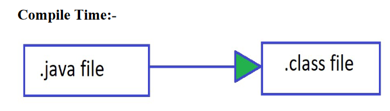

After we get the .class file, the next thing that happens at runtime is:
1. Class loader loads all classes needed to execute the program.
2. JVM sends the code to the bytecode verifier to check the format of the code.

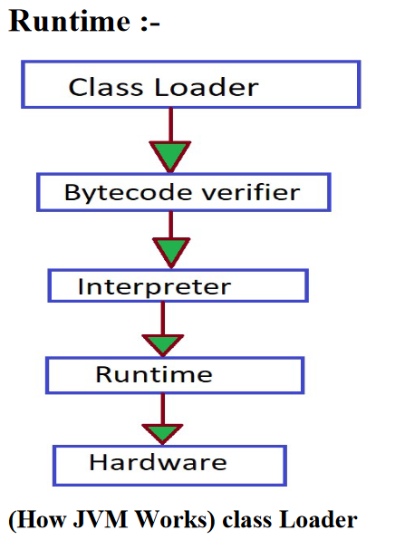
- Loading:
    1. Read .class file and generate binary data.
    2. Create an object of this class in the heap.
- Linking:
    1. JVM verifies the .class file.
    2. Allocates memory for class variables and default values.
    3. Replaces symbolic references from the type with direct references.
- Initialization:
    1. All static variables are assigned with their values defined in the code and static block.
    2. JVM contains the stack and heap memory locations.

### JVM Execution
- Interpreter:
    - Line by line execution.
    - When one method is called many times, it will interpret again and again.
- JIT (Just-In-Time):
    - For repeated methods, JIT provides direct machine code so that interpretation is not required. // when a function is called again and again.
    - Makes execution faster.
    - Garbage collector.
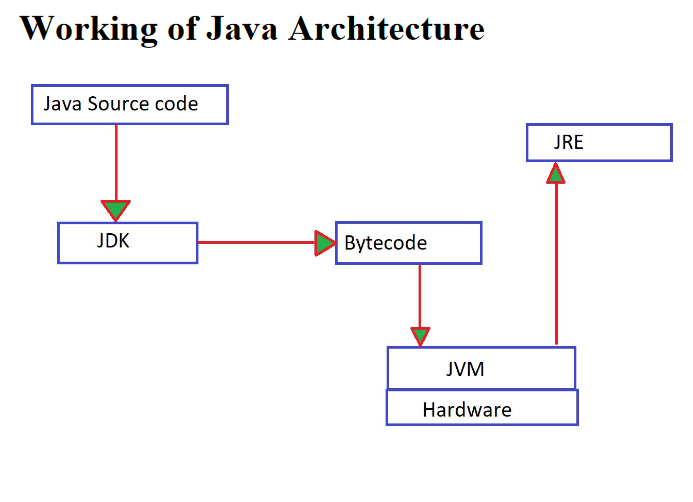

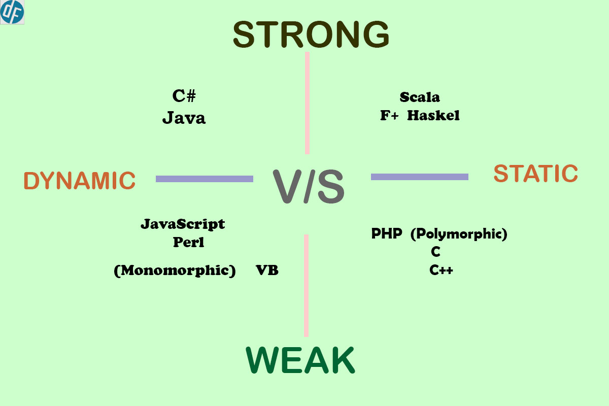
----

### **this is documented till the introduction to Java Architecture. and from now onwards I will attach a pdf file for all the coming tutorials and will also add comments on them or in a seprate md file.**