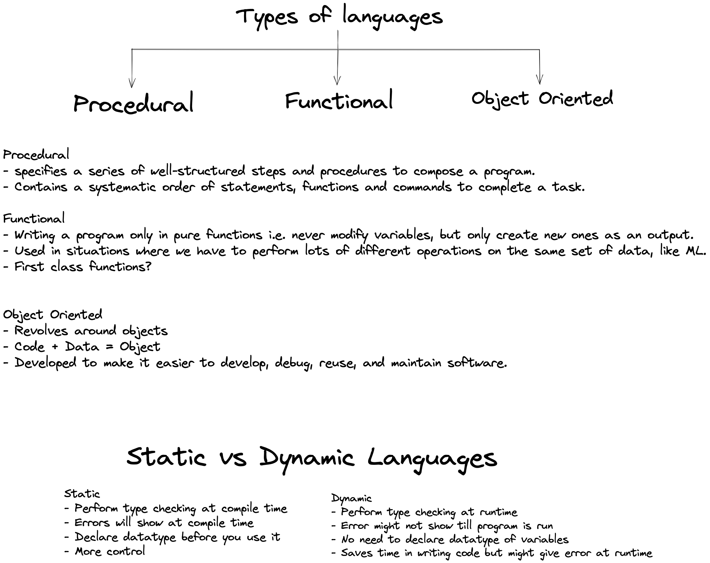
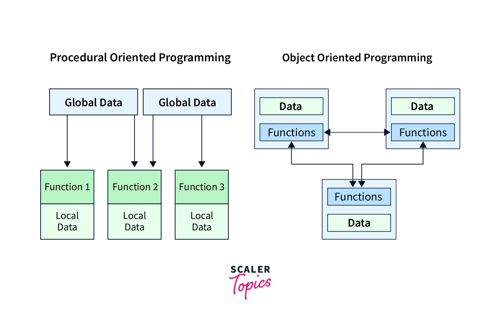
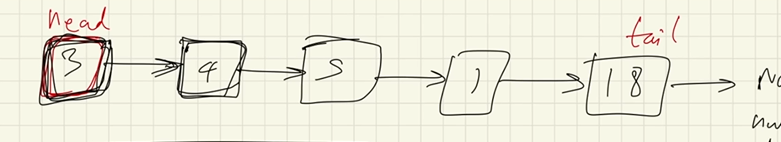
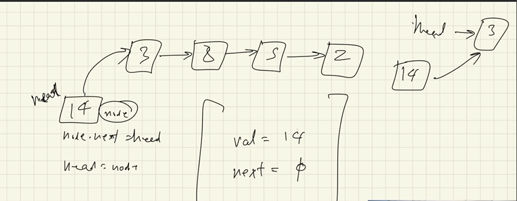
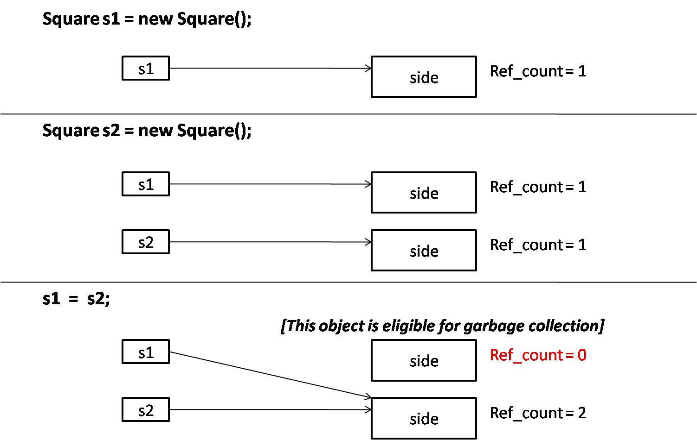
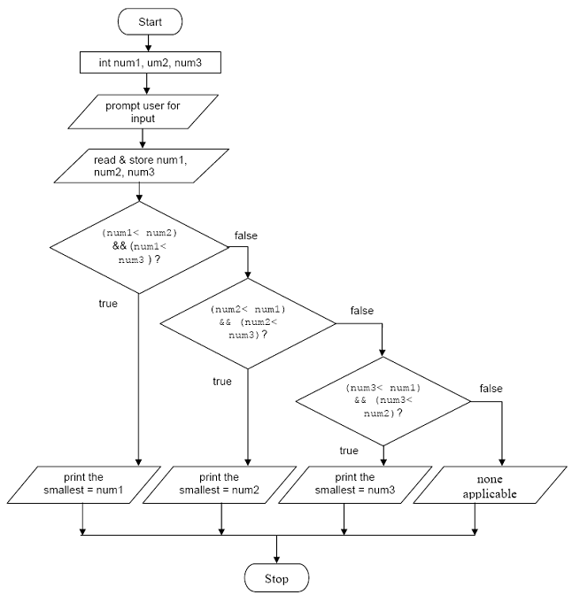
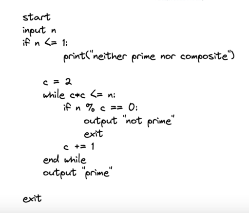
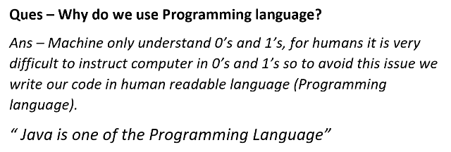
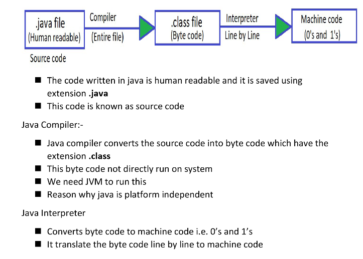
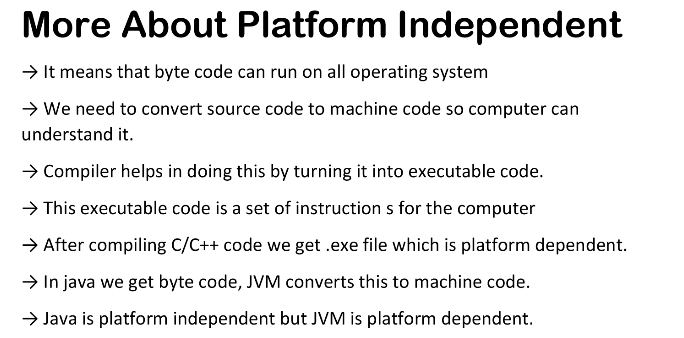

// from kunal khushwaha and Oracle official documentation and my notes.
1. on the minute lvl are a bunch of 0 and 1. and we are giving it instructions and programming language help us to right this and convert to something which machine understnad.



**first class functions** - when functions in that language are treated like any other variable. For example, in such a language, a function can be passed as an argument to other functions, can be returned by another function and can be assigned as a value to a variable.

if we have to create a custom datatype, which doesnt exist in any previous form we use `class` class is a general template. and instance (one occurance) of this class is called an `object`. object is a specific occurance. Naveen is the instance of class human.

Python follows all three and Java follows OOPS and Procedural.
*`Pure functional languages`, such as `Haskell`, only allow pure functional programs. Other languages allow both functional and procedural programs and are considered `impure functional languages`.*

`Java` is statically typed. `Python` is Dynamically typed.

**Compile time** refers to the phase of program execution where the source code is converted into machine code or bytecode. During this phase, the code is checked for syntax errors and type compatibility. If any errors are found, the code cannot be compiled successfully.

**Runtime** refers to the phase of program execution where the compiled code is actually executed. This is when the program interacts with the system and performs its intended tasks. Any errors or exceptions that occur during runtime can be handled or cause the program to terminate.

It is important to understand the difference between compile time and runtime because it affects how errors are detected and handled in a program. Compile time errors are caught before the program is executed, while runtime errors occur during program execution.

``` java
int a = 10 // left is defined at compile time therefore it cannot change its type and right is assigned at the runtime and the variable can be reassigned with another value of the same type.
a = kunal // this will therefore give an error. as its type is different.

```
``` python
int a = 10 # both sides are assigned at runtime therefore it can change its type on reassignment.

a = kunal # this will not therefore give an error. as its type is different.

```

## Memory Management
there are two types of memory Stacks and Heaps



reference variable is stored in `Stack`
the object is stored in `Heap`
the `reference variable` points to the `object`

> multiple reference variables can point to the same object. 
> 
> if any one of them changes the value of object therefore the change will be visible to all the other reference variables pointing to it. 
>

### `Changes in Heap persist and Stacks storages are temperory` 

### **In Java there is only Pass by Value. NO Pass by reference because even though a variable might hold a reference to an object, that object reference is a value that represents the object's location in memory. Object references are therefore passed by value.**

### object with no reference variable will be removed by garbage collector. 


## Basic Hello World Program
``` java
public class HelloWorld {
    public static void main(String[] args) {
        System.out.println("Hello, World!");
    }
}
```
Is string[] args necessary?
Whenever you run a Java program with command prompt or want to give command line arguments, then “String[] args” is used. So basically it takes input from you via command lines. If you don't use command line arguments then it has no purpose to your code.

## Flow of Program - Flowcharts & Pseudocode

### Flowcharts
Write a program that can read three integers from the user and then determines the smallest value among the three integers.



### Pseudocode

Pseudocode is like writing down the steps of a task or a program in a way that anyone can understand, without worrying about the exact rules of a programming language. It's a way to plan out how you want a computer program to work, using plain language and simple descriptions of what needs to be done at each step. It helps you organize your thoughts before you start writing actual code.

Find if no. is prime. 


## Java - Architecture 





### compiler. interpreter
### java is unique as it doesnt convert the file directly from java code to machine code but adds a intermediate step which is byte code. and this byte code needs java to run and convert it to the machine code. This is the reason why Java is independent. 


### the byte code that complier generates is platform independent. this is the program we can share and run it on any OS (operating System)
### but the JVM is platform dependent thats why we have JVM for that specific OS.
