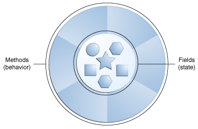

## Lesson: Language Basics

[Java official Documentation](https://docs.oracle.com/javase/tutorial/java/nutsandbolts/index.html)

Objects store their state in fields. However, the Java programming language also uses the term "variable" as well.

This section discusses this relationship, plus variable naming rules and conventions, basic data types (primitive types, character strings, and arrays), default values, and literals.

an `object` stores its `state` in `fields`.
```java
int cadence = 0;
int speed = 0;
int gear = 1;
```

`In the Java programming language, the terms "field" and "variable" are both used; this is a common source of confusion among new developers, since both often seem to refer to the same thing.`

---
### What Is an Object?

Objects are key to understanding object-oriented technology.
Real-world objects share two characteristics: They all have `state` and `behavior`

| SNo | Entity   | State                                              | Behaviour                                             |
| --- | -------- | -------------------------------------------------- | ----------------------------------------------------- |
| 1   | Dog      | name, color, breed, hungry                         | barking, fetching, wagging tai                        |
| 2   | Bicycles | current gear, current pedal cadence, current speed | changing gear, changing pedal cadence, applying brake |

_You may also notice that some objects, in turn, will also contain other objects._

### <p style="text-align: center;">A software object.</p>



Software objects stores its `state` in `fields` (variables in some programming languages) and exposes its `behavior` through `methods` (functions in some programming languages).

> Methods operate on an object's internal state and serve as the primary mechanism for object-to-object communication. Hiding internal state and requiring all interaction to be performed through an object's methods is known as `data encapsulation` — a fundamental principle of object-oriented programming.


`we are basically talking about functions/methods which relate to Behaviour of object and variable/fields which relate to the state of the object`


example fo a bicylce

> Bundling code into individual software objects provides a number of benefits, including:
    
1. `Modularity`: The source code for an object can be written and maintained independently of the source code for other objects. Once created, an object can be easily passed around inside the system.
2. `Information-hiding`: By interacting only with an object's methods, the details of its internal implementation remain hidden from the outside world.
3. `Code re-use`: If an object already exists (perhaps written by another software developer), you can use that object in your program. This allows specialists to implement/test/debug complex, task-specific objects, which you can then trust to run in your own code.
4. `Pluggability and debugging ease`: If a particular object turns out to be problematic, you can simply remove it from your application and plug in a different object as its replacement. This is analogous to fixing mechanical problems in the real world. If a bolt breaks, you replace it, not the entire machine.

---


>The static keyword is used to represent the class member. It is basically used with methods and variables to indicate that it is a part of the class, not the object. On the other hand, the final keyword is used to proclaim a constant variable and to bind the user from accessing a method, variable, or class.

The Java programming language defines the following kinds of variables:

1. `Instance Variables (Non-Static Fields)`: Technically speaking, objects store their individual states in "non-static fields", that is, fields declared without the static keyword. Non-static fields are also known as `instance variables` because their values are unique to `each instance of a class` (to each object, in other words); the currentSpeed of one bicycle is independent from the currentSpeed of another.

2. `Class Variables (Static Fields)`: A class variable is any field declared with the `static modifier`; this tells the compiler that there is exactly one copy of this variable in existence, regardless of how many times the class has been instantiated. A field defining the number of gears for a particular kind of bicycle could be marked as static since conceptually the same number of gears will apply to all instances. The code `static int numGears = 6`; would create such a static field. Additionally, the keyword `final` could be added to indicate that the number of gears will never change.
3. `Local Variables`: Similar to how an object stores its state in fields, a method will often store its temporary state in local variables. The syntax for declaring a local variable is similar to declaring a field (for example, int count = 0;). There is no special keyword designating a variable as local; that determination comes entirely from the location in which the variable is declared — which is between the opening and closing braces of a method. As such, local variables are only visible to the methods in which they are declared; `they are not accessible from the rest of the class`.
4. `Parameters`: You've already seen examples of parameters, both in the Bicycle class and in the main method of the "Hello World!" application. Recall that the signature for the main method is `public static void main(String[] args)`. Here, the `args` variable is the parameter to this method. The important thing to remember is that `parameters are always classified as "variables" not "fields"`. `This applies to other parameter-accepting constructs` as well (such as constructors and exception handlers). 

### **Difference between variables and fields**
| Variables                                                                                                                                                                                                                                                                                                                                                                                                                                         | Fields                                                                                                                                                                                                                                                                                                                                                                                      |
| ------------------------------------------------------------------------------------------------------------------------------------------------------------------------------------------------------------------------------------------------------------------------------------------------------------------------------------------------------------------------------------------------------------------------------------------------- | ------------------------------------------------------------------------------------------------------------------------------------------------------------------------------------------------------------------------------------------------------------------------------------------------------------------------------------------------------------------------------------------- |
| Variables and fields are both used to store data, but they serve different purposes and contexts. Variables are general-purpose containers for storing data values, and they can have different scopes such as local, global, or block-scoped, depending on where they are defined and how they are used within a program. Variables can be used in functions, blocks, or throughout the entire program, with their lifetime tied to their scope. | Fields, on the other hand, are a specific type of variable associated with classes and objects in object-oriented programming. Fields are used to store the state or properties of an object and are scoped to the class or the instance of the object. While all fields are variables, not all variables are fields; fields are specific to the structure and state management of classes. |


> When discussing fields and variables. If we are talking about `"fields in general"` (excluding local variables and parameters), `we may simply say "fields"`. If the discussion applies to `"all of the above"`, we may simply say `"variables"`. If the context calls for a distinction, we will use `specific terms` (static field, local variables, etc.) as appropriate. You may also occasionally see the term `"member"` used as well. A `type's fields, methods, and nested types` are collectively called its members.

## Naming
The rules and conventions for naming your variables can be summarized as follows:

1. Variable names are` case-sensitive`. A variable's name can be any `legal identifie`r — an unlimited-length sequence of Unicode letters and digits, beginning with a letter, the dollar sign "$", or the underscore character "_". The convention, however, is to always begin your variable names with a letter, not "$" or "_". White space is not permitted.
2. Subsequent characters may be letters, digits, dollar signs, or underscore characters. Conventions (and common sense) apply to this rule as well. When choosing a name for your variables, use full words instead of cryptic abbreviations. Doing so will make your code easier to read and understand. In many cases it will also make your code self-documenting; fields named cadence, speed, and gear, for example, are much more intuitive than abbreviated versions, such as s, c, and g. Also keep in mind that the name you choose must not be a keyword or reserved word.
3. If the name you choose consists of only `one word`, spell that word in `all lowercase letters`. If it consists of `more than one word`, capitalize the first letter of each subsequent word. The names `gearRatio` and currentGear are prime examples of this convention. If your variable stores a constant value, `such as static final int NUM_GEARS = 6`, the convention changes slightly, capitalizing every letter and separating subsequent words with the underscore character. By convention, the underscore character is never used elsewhere.


## Primitive Data Types

| **Data Type** | **Description**                                                        | **Size**                           | **Range**                                          | **Usage**                                                |
| ------------- | ---------------------------------------------------------------------- | ---------------------------------- | -------------------------------------------------- | -------------------------------------------------------- |
| byte          | 8-bit signed two's complement integer| 8 bits | -128 to 127| Memory savings in large arrays |
| short         | 16-bit signed two's complement integer                                 | 16 bits                            | -32,768 to 32,767                                  | Memory savings in large arrays                           |
| int           | 32-bit signed two's complement integer (can be unsigned in Java SE 8+) | 32 bits                            | -2^31 to 2^31-1 (signed)<br>0 to 2^32-1 (unsigned) | Default integer type                                     |
| long          | 64-bit signed two's complement integer (can be unsigned in Java SE 8+) | 64 bits                            | -2^63 to 2^63-1 (signed)<br>0 to 2^64-1 (unsigned) | Use when a wider range than int is needed                |
| float         | Single-precision 32-bit IEEE 754 floating point                        | 32 bits                            | Specified in Java Language Specification           | Memory savings in large arrays of floating point numbers |
| double        | Double-precision 64-bit IEEE 754 floating point                        | 64 bits                            | Specified in Java Language Specification           | Default choice for decimal values                        |
| boolean       | Represents true or false                                               | 1 bit (size not precisely defined) | true or false                                      | Simple flags for true/false conditions                   |
| char          | Single 16-bit Unicode character                                        | 16 bits                            | '\u0000' (0) to '\uffff' (65,535)                  | Storing characters                                       |


The Java programming language is statically-typed, which means that all variables must first be declared before they can be used. This involves stating the variable's type and name, as you've already seen:

`int gear = 1;`
Doing so tells your program that a field named "gear" exists, holds numerical data, and has an initial value of "1".

### Java Primitive Data Types

The eight primitive data types supported by the Java programming language are:

### byte
- **Description**: 8-bit signed two's complement integer.
- **Range**: -128 to 127 (inclusive).
- **Usage**: Useful for saving memory in large arrays and clarifying code with limited variable range.

### short
- **Description**: 16-bit signed two's complement integer.
- **Range**: -32,768 to 32,767 (inclusive).
- **Usage**: Similar to byte, used for saving memory in large arrays.

### int
- **Description**: 32-bit signed two's complement integer.
- **Range (signed)**: -2³¹ to 2³¹-1.
- **Range (unsigned)**: 0 to 2³²-1 (Java SE 8 and later).
- **Usage**: Default integer type. Use the Integer class for unsigned operations with methods like `compareUnsigned` and `divideUnsigned`.

### long
- **Description**: 64-bit signed two's complement integer.
- **Range (signed)**: -2⁶³ to 2⁶³-1.
- **Range (unsigned)**: 0 to 2⁶⁴-1 (Java SE 8 and later).
- **Usage**: When a wider range than int is needed. Use the Long class for unsigned operations with methods like `compareUnsigned` and `divideUnsigned`.

### float
- **Description**: Single-precision 32-bit IEEE 754 floating point.
- **Range**: Specified in the Java Language Specification.
- **Usage**: Memory savings in large arrays of floating point numbers. Not for precise values (e.g., currency), use `java.math.BigDecimal` for precision.

### double
- **Description**: Double-precision 64-bit IEEE 754 floating point.
- **Range**: Specified in the Java Language Specification.
- **Usage**: Default for decimal values. Not for precise values (e.g., currency).

### boolean
- **Description**: Represents true or false.
- **Size**: 1 bit (size not precisely defined).
- **Usage**: Simple flags for true/false conditions.

### char
- **Description**: Single 16-bit Unicode character.
- **Range**: '\u0000' (0) to '\uffff' (65,535 inclusive).
- **Usage**: Storing characters.

> _In addition to the eight primitive data types listed above, the Java programming language also provides special support for character strings via the java.lang.String class. Enclosing your character string within double quotes will automatically create a new String object; for example, String s = "this is a string";. String objects are immutable, which means that once created, their values cannot be changed. The String class is not technically a primitive data type, but considering the special support given to it by the language, you'll probably tend to think of it as such. You'll learn more about the String class in Simple Data Objects_

### Default Values

> **It's not always necessary to assign a value when a field is declared. Fields that are declared but not initialized will be set to a reasonable default by the compiler. Generally speaking, this default will be zero or null, depending on the data type.**

| **Data Type**          | **Default Value (for fields)** |
| ---------------------- | ------------------------------ |
| byte                   | 0                              |
| short                  | 0                              |
| int                    | 0                              |
| long                   | 0L                             |
| float                  | 0.0f                           |
| double                 | 0.0d                           |
| char                   | '\u0000'                       |
| String (or any object) | null                           |
| boolean                | false                          |

`Local variables are slightly different; the compiler never assigns a default value to an uninitialized local variable. If you cannot initialize your local variable where it is declared, make sure to assign it a value before you attempt to use it. Accessing an uninitialized local variable will result in a compile-time error.`


### Literals


You may have noticed that the `new keyword `isn't used when initializing a variable of a primitive type. Primitive types are special data types built into the language; they are not objects created from a class. A literal is the source code representation of a fixed value; literals are represented directly in your code without requiring computation. As shown below, it's possible to assign a literal to a variable of a primitive type:

```boolean result = true;
char capitalC = 'C';
byte b = 100;
short s = 10000;
int i = 100000;
```


### Integer Literals

`An integer literal is of type long if it ends with the letter L or l`; otherwise it is of type int. It is recommended that you use the upper case letter L because the lower case letter l is hard to distinguish from the digit 1.

`Values of the integral types byte, short, int, and long can be created from int literals`. Values of type long that exceed the range of int can be created from `long literals`. Integer literals can be expressed by these number systems:

1. Decimal: Base 10, whose digits consists of the numbers 0 through 9; this is the number system you use every day
2. Hexadecimal: Base 16, whose digits consist of the numbers 0 through 9 and the letters A through F
3. Binary: Base 2, whose digits consists of the numbers 0 and 1 (you can create binary literals in Java SE 7 and later)

The prefix 0x indicates hexadecimal and 0b indicates binary:

```
// The number 26, in decimal
int decVal = 26;
//  The number 26, in hexadecimal
int hexVal = 0x1a;
// The number 26, in binary
int binVal = 0b11010;
```
### Floating-Point Literals

A floating-point literal is of type float if it ends with the letter F or f; otherwise its type is double and it can optionally end with the letter D or d.

The floating point types (float and double) can also be expressed using E or e (for scientific notation), F or f (32-bit float literal) and D or d (64-bit double literal; this is the default and by convention is omitted).

```
double d1 = 123.4;
// same value as d1, but in scientific notation
double d2 = 1.234e2;
float f1  = 123.4f;
```

### Character and String Literals
read if you need it

### Using Underscore Characters in Numeric Literals

read if you need it.

---
---
