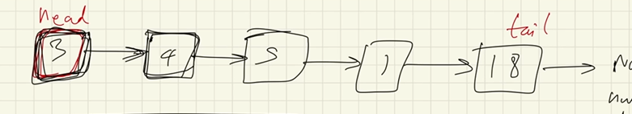
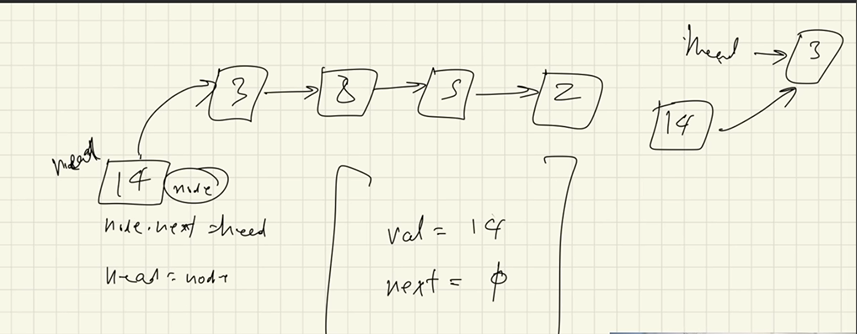

# LinkedLists

we can be asked to do multiple things in LL like recursion, Sorts(merge etc...) 

### diff between LL and AL (arraylist)

Arrays are continious memory allocation but LL is not continious it is more of pointer based allocation of memory in heap.

There are reference variables in LL like Head and Tail.

``` Java
class Node{
    int val; // val of the curr node
    Node.next; // points to the next node
}
// this is a node
```


adding something at end of the LL
make a new node and then point the tail to it and make it tail.

``` java
//custom LL not the inbuild one
// taking a node head and tail to access it from outside
public class LL {
    private Node head; // pointing to the head node.
    private Node tail;
    //size
    private int size;
    // custom node is beind build
    private class Node{
        private int value;
        private Node next;

        public Node(int value){
            this.value;
        }

        public Node(int value, Node next){
            this.value = value;
            this.next = next;
        }
    }


}

```
visualize what to do then do it



```Java
//insert 
```